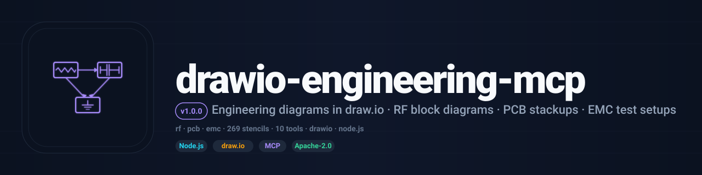

<div align="center">



<br/>

[](LICENSE)
[](https://nodejs.org)
[](https://modelcontextprotocol.io)
[](https://github.com/RFingAdam/eng-mcp-suite)

**Engineering diagrams in draw.io: RF block diagrams, PCB stackups, and EMC test setups generated from structured prompts.**
**Drive it from your IDE, terminal, or AI agent and skip the manual stencil-dragging.**

[Quick start](#quick-start) ·
[Tools](#tools) ·
[Workflows](#workflows) ·
[Documentation](#documentation)

</div>

---

## What is drawio-engineering-mcp?

`drawio-engineering-mcp` is a Node.js MCP server that gives an AI agent
the ability to create, view, and analyze engineering diagrams in
[draw.io](https://app.diagrams.net). It extends the
[official draw.io MCP](https://github.com/jgraph/drawio-mcp) (`@drawio/mcp`)
with 10 tools and **269 drag-and-drop engineering symbols** across RF,
PCB, EMC, wireless, electrical, and general engineering.

Where the upstream MCP gives you a diagram editor, this one gives you a
diagram *generator*: an RF receiver signal chain with Friis-cascade
annotations, a CISPR 25 / ISO 11452 test setup, a 6-layer PCB stackup
with material-property labels. All from a one-sentence prompt or
structured JSON input.

**What it does well:**

- 🤖 **AI-native via MCP.** First-class [Model Context Protocol](https://modelcontextprotocol.io)
  server with **10 tools** wired into the draw.io browser app.
- 🎨 **269 engineering stencils.** RF blocks, amplifiers, filters,
  antennas, PCB stackup vias, EMC test equipment, wireless protocol
  badges, connectors, power ICs. All auto-loaded into the draw.io sidebar.
- ⚡ **Auto-layout generators.** `create_rf_block_diagram` runs Friis
  gain/NF cascade math; `create_pcb_stackup` renders cross-sections
  with material properties; `create_emc_test_setup` uses CISPR / ISO
  templates.
- ✅ **Round-trip.** `read_drawio` parses `.drawio` XML into structured
  JSON (shapes, edges, styles) so an agent can analyze an existing
  diagram. `export_drawio` renders to SVG / PNG.
- 🔒 **AGPL-3.0-or-later.** Built on the official draw.io MCP foundation
  (Apache-2.0); this server's engineering extensions are AGPL-3.0-or-later.

---

## Quick start

### Install

```bash
git clone https://github.com/RFingAdam/drawio-engineering-mcp.git
cd drawio-engineering-mcp
npm install
```

### Three surfaces, same answer

<table>
<tr>
<td valign="top" width="50%">

**Claude Code**

```bash
claude mcp add drawio-engineering -s user -- \
  node /path/to/drawio-engineering-mcp/src/index.js
```

</td>
<td valign="top" width="50%">

**Claude Desktop**

```json
{
  "mcpServers": {
    "drawio-engineering": {
      "command": "node",
      "args": ["/path/to/drawio-engineering-mcp/src/index.js"]
    }
  }
}
```

</td>
</tr>
<tr>
<td colspan="2" valign="top">

**Any MCP client: first prompt**

Start a new session and ask:

> *"Create an RF receiver signal chain with antenna, SAW filter, LNA, mixer
> with PLL LO, IF filter, and ADC. Show cumulative gain and noise figure."*

The agent calls `create_rf_block_diagram` and opens draw.io with a
color-coded, auto-laid-out diagram annotated with Friis cascade values.

</td>
</tr>
</table>

---

## Tools

10 MCP tools across 3 categories. Full reference in [`docs/tools.md`](docs/tools.md).

### Viewer / editor

| Tool                       | Purpose                                                              | Key arguments                |
| -------------------------- | -------------------------------------------------------------------- | ---------------------------- |
| `open_drawio_xml`          | Open draw.io with raw XML content                                    | `xml`                        |
| `open_drawio_csv`          | Open draw.io with CSV data                                           | `csv`, `style`               |
| `open_drawio_mermaid`      | Open draw.io with Mermaid syntax                                     | `mermaid`                    |
| `open_drawio_engineering`  | Open draw.io with the 269 engineering stencils loaded in the sidebar | `stencils`                   |

### Generators

| Tool                       | Purpose                                                              | Key arguments                |
| -------------------------- | -------------------------------------------------------------------- | ---------------------------- |
| `create_rf_block_diagram`  | Auto-layout RF signal chain from JSON (Friis gain/NF cascade)        | `blocks`, `frequency_ghz`    |
| `create_emc_test_setup`    | CISPR 25 / ISO 11452 EMC test setup diagrams from templates          | `template`, `dut_name`       |
| `create_pcb_stackup`       | PCB cross-section stackup diagrams (4-layer / 6-layer / custom)      | `layers`, `materials`        |
| `markup_schematic`         | Annotate schematic screenshots with redlines, revision clouds, callouts | `image_path`, `annotations` |

### Analysis

| Tool                       | Purpose                                                              | Key arguments                |
| -------------------------- | -------------------------------------------------------------------- | ---------------------------- |
| `read_drawio`              | Parse `.drawio` files into structured JSON (shapes, edges, styles)   | `file_path`                  |
| `export_drawio`            | Export diagrams to SVG (or PNG with puppeteer)                       | `file_path`, `format`        |

---

## Stencil libraries

269 engineering symbols across 13 libraries, automatically loaded by
`open_drawio_engineering` into the draw.io sidebar:

| Library                   | Symbols | Contents                                                                  |
| ------------------------- | ------- | ------------------------------------------------------------------------- |
| `rf-blocks`               | 30      | Core RF blocks (LNA, PA, mixer, filter, switch, antenna, …)               |
| `rf-amplifiers-mixers`    | 16      | Amplifier variants (LNA, PA, VGA, driver, buffer, log, limiting) + mixers |
| `rf-filters-attenuators`  | 17      | BPF, LPF, HPF, notch, cavity, SAW, BAW, DSA, step / variable atten        |
| `rf-passive-components`   | 14      | Circulators, isolators, directional couplers, Wilkinson, hybrid, balun    |
| `rf-sources-oscillators`  | 10      | Crystal, TCXO, OCXO, VCO, PLL, DDS, synthesizer                           |
| `rf-switches-detectors`   | 15      | SPDT, SP4T, transfer, T/R, power detector, ADC, DAC                       |
| `rf-antennas-txlines`     | 20      | Dipole, patch, horn, array, MIMO, coax, microstrip, waveguide             |
| `ee-power-ics`            | 20      | LDO, buck, boost, flyback, battery, SoC, FPGA, MCU, QFN, BGA              |
| `ee-connectors`           | 14      | SMA, U.FL, N-type, BNC, USB-C, RJ45, pin header, B2B                      |
| `ee-test-equipment-emc`   | 18      | Spectrum analyzer, VNA, scope, LISN, CDN, anechoic chamber                |
| `pcb-stackup-vias`        | 30      | Copper / prepreg / core layers, through / blind / buried / micro vias, impedance traces |
| `wireless-telecom`        | 27      | Wi-Fi, BLE, LTE, 5G NR, LoRa, Zigbee, Thread, protocol badges, OFDM, QAM  |
| `general-engineering`     | 38      | System blocks, rack diagrams, cables, thermal management, R/L/C/transformer |

By default all libraries load. To load only specific ones:

```json
{
  "stencils": ["rf-blocks", "ee-connectors", "pcb-stackup-vias"]
}
```

---

## Workflows

`drawio-engineering-mcp` fits in the following [eng-mcp-suite](https://github.com/RFingAdam/eng-mcp-suite)
workflow bundles:

- **`emc-compliance`**: pair `create_emc_test_setup` with
  `mcp-emc-regulations` to generate the test setup diagram for the
  exact CISPR / ISO method the limit lookup returned.
- **`pcb-review`**: generate `create_pcb_stackup` cross-sections during
  a `mcp-pcb-emcopilot` design review.
- **`rf-design`**. Use `create_rf_block_diagram` to visualize the
  cascade an LNA / mixer / filter chain produces: Friis numbers
  annotated automatically.

Part of [eng-mcp-suite](https://github.com/RFingAdam/eng-mcp-suite).
Use in the `emc-compliance`, `pcb-review`, or `rf-design` workflow bundles.

See the [suite manifest](https://github.com/RFingAdam/eng-mcp-suite/blob/main/manifest.yaml)
for the full list of sibling MCPs and bundle definitions.

---

## Documentation

- 📘 **[Quick Start](docs/index.md)**: install through first call.
- 🛠️ **[Tool reference](docs/tools.md)**. Every MCP tool, every argument.
- 📐 **[Usage examples](docs/usage.md)**: practical end-to-end walkthroughs.
- 🏗️ **[Architecture](docs/architecture.md)**: how this MCP fits in eng-mcp-suite.

---

## Part of eng-mcp-suite

<sub>This MCP server is part of</sub>

[](https://github.com/RFingAdam/eng-mcp-suite)

<sub>An open umbrella for engineering MCP servers across RF, EMC, PCB,
signal integrity, EM simulation, and lab test. Same brand, same docs
structure, designed to compose. See the
[full catalog](https://github.com/RFingAdam/eng-mcp-suite#whats-included)
or jump to a sibling:</sub>

| Domain                      | Sibling MCPs                                                                 |
| --------------------------- | ---------------------------------------------------------------------------- |
| **RF / Transmission lines** | [lineforge](https://github.com/RFingAdam/lineforge)                          |
| **EMC regulatory**          | [mcp-emc-regulations](https://github.com/RFingAdam/mcp-emc-regulations)      |
| **PCB / SI**                | mcp-pcb-emcopilot *(private: public soon)*                                  |
| **EM simulation**           | mcp-openems, mcp-nec2-antenna *(private: public soon)*                      |
| **Diagrams**                | **drawio-engineering-mcp** *(this repo)*                                     |
| **3D / rendering**          | [mcp-blender](https://github.com/RFingAdam/mcp-blender)                      |
| **Remote access**           | [mcp-remote-access](https://github.com/RFingAdam/mcp-remote-access)          |
| **Lab gear**                | [copper-mountain-vna-mcp](https://github.com/RFingAdam/copper-mountain-vna-mcp), mcp-rs-spectrum-analyzer, mcp-rs-siggen, mcp-rs-cmw500 |

---

## Based on

Extended from the [official draw.io MCP server](https://github.com/jgraph/drawio-mcp)
(`@drawio/mcp`) by JGraph Ltd.

## Contributing

Contributions are welcome.

1. **Pick a [GitHub issue](https://github.com/RFingAdam/drawio-engineering-mcp/issues)**.
2. **Fork + branch** (`feature/your-thing` or `fix/your-bug`).
3. **Run tests** (`npm test`) if present.
4. **Open a PR**: link the issue, request review.

---

## License

[AGPL-3.0-or-later](LICENSE). Relicensed from Apache-2.0 in v1.1.0 to
align with the eng-mcp-suite toolkit-wide AGPL move. The upstream
draw.io MCP foundation remains Apache-2.0; this server's engineering
extensions and added tooling are AGPL-3.0-or-later.

## Trademarks and brand assets

This project is not affiliated with, endorsed by, or sponsored by JGraph Ltd.
"draw.io" and "diagrams.net" are trademarks of JGraph Ltd. They are used here
only to identify the software this project interoperates with.

The project name and the logo files in this repository are not part of the licensed
work. The licence above grants no permission to use them, except as needed to describe
the origin of the work.

## Commercial licensing

This project is licensed under AGPL-3.0-or-later. A commercial license
(for embedding in a closed-source product, hosting as a paid service
without AGPL's share-back obligations, or proprietary redistribution)
is available on a case-by-case basis. See [eng-mcp-suite's licensing
policy](https://github.com/RFingAdam/eng-mcp-suite/blob/main/LICENSE_SUMMARY.md#commercial-licensing)
or open an issue and tag `@RFingAdam`.

## Acknowledgments

- **[JGraph Ltd / draw.io](https://www.diagrams.net)**: for the
  upstream `@drawio/mcp` and the underlying diagram editor.
- **The MCP working group**: for the [Model Context Protocol](https://modelcontextprotocol.io) specification.

<div align="center">

<sub>Part of <a href="https://github.com/RFingAdam/eng-mcp-suite">eng-mcp-suite</a>: built for RF engineers, PCB designers, EMC labs, and AI agents.</sub>

</div>
